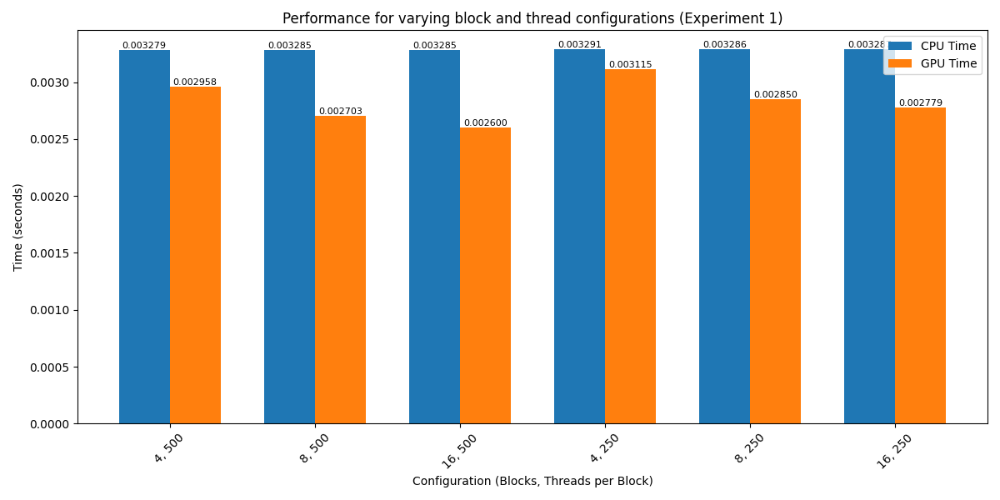

# CUDA Vector Processor
This project involves writing a simple CUDA program to process vectors. The goal is to perform vector operations on both the CPU and GPU, measure the execution time for each, and analyze the speedup achieved using various configurations of blocks and threads on the GPU.

## Project Overview
The task is to compute the operation c[i] += a[i] * b[i] for three dynamically allocated arrays (a, b, and c) of size n. This operation is performed sequentially on the CPU and in parallel on the GPU. The execution time for both implementations is measured and compared.

## Project Structure
- `vectors.cu`: CUDA program that performs vector operations on both CPU and GPU.
- `run_experiments.sh`: Shell script that runs the experiments with different configurations and input sizes, and saves the results to a CSV file.
- `generate_charts.py`: Python script that reads the experiment results from the CSV file and generates charts comparing CPU and GPU performance.
- `experiment_results.csv`: CSV file that contains the results of the experiments.

## Compilation
To compile the CUDA program (`vectors.cu`), use the following command:

```bash
nvcc vectors.cu -o vectorprog
```

This will generate the executable `vectorprog`.

## Usage
To run the program, use the following command:

```bash
./vectorprog <num_elements> <blocks_per_grid> <threads_per_block>
```

- `<num_elements>`: The number of elements in the vectors.
- `<blocks_per_grid>`: The number of blocks per grid in the GPU kernel.
- `<threads_per_block>`: The number of threads per block in the GPU kernel.

For example:

```bash
./vectorprog 1000000 8 500
```

This will process vectors of 1,000,000 elements using 8 blocks per grid and 500 threads per block.

## Running Experiments
The `run_experiments.sh` script automates running the experiments with different configurations and input sizes. It saves the results in the `experiment_results.csv` file.

### Running the Experiment Script
```bash
chmod +x run_experiments.sh
./run_experiments.sh
```

This will execute the program with different configurations and store the CPU and GPU times in `experiment_results.csv`.

### Experiment Configurations
- **Experiment 1**: Varying the number of blocks and threads with a fixed input size of 1,000,000 elements.
- **Experiment 2**: Varying the input size with a fixed configuration of 8 blocks and 500 threads per block.

The results will be saved in `experiment_results.csv` with the following format:

```csv
experiment,blocks,threads,input_size,cpu_time,gpu_time
experiment1,4,500,1000000,0.003290,0.000803
experiment1,8,500,1000000,0.003283,0.000672
experiment2,8,500,100,0.000004,0.000454
...
```

## Generating Charts
The `generate_charts.py` script reads the `experiment_results.csv` file and generates bar charts comparing the performance of CPU and GPU.

### Running the Chart Generation Script
To generate the charts, use the following command:

```bash
python generate_charts.py
```

The script will output two charts:
- `plot_experiment1.png`: Compares CPU and GPU times for varying block and thread configurations.
- `plot_experiment2.png`: Compares CPU and GPU times for varying input sizes.

### Example of Experiment 1 Output


### Example of Experiment 2 Output


## Results
The experiment results show the performance improvements achieved using parallel processing on the GPU compared to sequential processing on the CPU.

- For small input sizes, the CPU can sometimes perform better due to the overhead of launching GPU kernels.
- For large input sizes, the GPU outperforms the CPU, as it is designed for parallel computation on large datasets.

## License
This project is licensed under the MIT License.